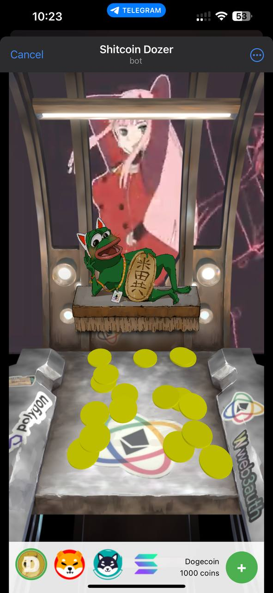

# ShitCoin / Meme Coin dozer for Eth Brussels Hackathon 2024

This is the Front End Repo for Eth Brussels Hackathon 2024 Meme Coin Dozer.

The Smart Contracts Repo can be found here: [Meme Coin Dozer Contracts](https://github.com/ML-Village/dozer-contracts) 

The ZKML API code can be found here: [ZKML Repo for Meme Coin Dozer](https://github.com/ML-Village/dozer-zkml)

We have deployed contracts to the following chains (testnets/sepolias) without problems (most of them with Scanner verification)  
(Some of the addresses may look the same as they are deployed with the same nounces)

**Deployed Addresses (Game)**
Base : 0x9d71865290cca388D427807C971fe7f6C364f5B4
Arbi : 0x254aEC4487b08A53c32De73f234574246f1A0052
Scroll : 0x9Db954a49B6Bf304ACc4B5D76c723c1cC9C7E073
Rootstock : 0x9DB954a49b6bf304aCc4B5D76C723C1cC9C7E073
APE Chain : 0x9Db954a49B6Bf304ACc4B5D76c723c1cC9C7E073
Zircuit : 0x9Db954a49B6Bf304ACc4B5D76c723c1cC9C7E073

Hope u had some laughs and fun.

  

